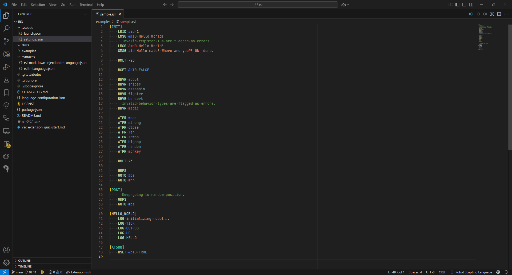

# rsl README

VSCode extension to syntax highlight .rsl files.

"RSL" stands for "Robot Scripting Language" and was part of the DroidArena game that is now all but lost.
Archived version can be found at the Internet Archive: https://web.archive.org/web/20090223112315/http://www.droidarena.net:80/dascripts/info/manual/rsl1_2.html

## Features

This extension provides simple syntax highlighting for the RSL 1.2 format.

## Release Notes

### 0.0.1

Initial release of RSL syntax highlighting.
